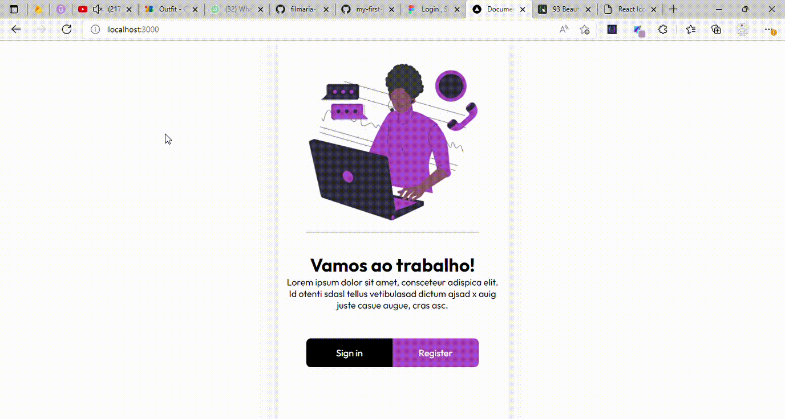

# Interface Login and Register

<!---Esses são exemplos. Veja https://shields.io para outras pessoas ou para personalizar este conjunto de escudos. Você pode querer incluir dependências, status do projeto e
 informações de licença aqui--->

> Login and Registration Interfaces for future Calling System application.

### Adjustments and improvements

> The project has been finished.

- [x] Page Home 
- [x] Page Login
- [x] Page Register
- [x] Routes with react router dom 
- [x] HTML
- [x] Stylization with CSS
- [x] Use the react icons

### How project works

Soon with the back end, the user will be able to register or if he already has an account, he will be able to log in automatically with his email and password.

### How it was developed

The App was developed with React, using components, routes and pages.

## 🤝 Collaborator

<table>
  <tr>
    <td align="center">
      <a href="#">
         
        
          <b>João Guilherme</b>
        
      </a>
    </td>
  </tr>
</table>

## 👨‍💻 Technologies
Technologies used in the project:

